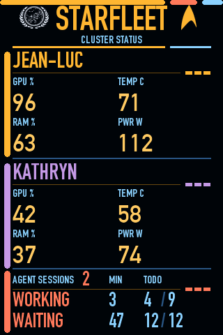

# Starfleet

Monitoring for a small home GPU cluster, on three surfaces: a **macOS menu bar
app**, a **floating desktop widget**, and a **physical 3.5" USB panel** on the
desk.

It watches two NVIDIA DGX Spark nodes over SSH — GPU load, temperature, power,
memory, which models `llama-swap` currently has resident, and which coding-agent
sessions are running on them — and reports all of it at a glance.

<p align="center">
  
</p>

Named after the cluster it watches: the nodes are **Jean-Luc** and **Kathryn**,
so the fleet is Starfleet.

---

## The three surfaces

| Surface | What it's for |
| --- | --- |
| **Menu bar** | Always-visible health glyph + a `⚡N` count of actively-generating sessions. Click for the full per-host breakdown, expandable session transcripts, and settings. |
| **Desktop widget** | A borderless always-on-top panel with the same live data, for when you want it visible without clicking. Drag anywhere; position persists. |
| **USB IPS panel** | A physical 320×480 LCARS-styled readout on the desk. Costs no extra SSH — it feeds off the same pollers. |

All three share one set of `StatusPoller`s, so adding a surface adds **zero**
polling load on the cluster.

---

## The Starfleet cluster

Two **NVIDIA DGX Spark** nodes, each a GB10 with ~121 GiB of unified memory and
20 CPU cores, on the same LAN and reachable over Tailscale:

| Node | Role |
| --- | --- |
| **Jean-Luc** | Head node. Runs the `llama-swap` orchestrator, which fronts every model behind a single OpenAI-compatible endpoint, plus Ollama. |
| **Kathryn** | Worker. Serves models of her own, and pairs with Jean-Luc for tensor-parallel jobs. |

`llama-swap` loads and unloads models on demand and groups them so they don't
fight over memory — small models co-reside, a huge one evicts everything else,
and Kathryn's pool is deliberately independent (loading a model on her machine
frees nothing on his, so her models must never evict his, or vice versa).

Models are named for what they are and where they run:

```
gemma4-26b-46tps-jean-luc     pinned to the head node
gemma4-26b-46tps-kathryn      pinned to the worker
gemma4-26b-48tps-starfleet    tensor-parallel across BOTH
```

The embedded tok/s figure is the measured single-stream throughput of that exact
configuration, so the fastest option is obvious from the name alone.

---

## Why tensor parallelism matters here

**Tensor parallelism (TP)** splits each layer's weight matrices across GPUs.
Every node holds a *slice* of every layer, computes its share, and the partial
results are combined with an all-reduce before the next layer. Contrast with
pipeline parallelism, which gives each node whole *layers* — TP keeps both nodes
busy on every token, at the cost of a network round-trip per layer.

For a two-Spark fleet that buys two distinct things.

### 1. Capacity — models that simply don't fit otherwise

One Spark has ~121 GiB. TP=2 pools both, so the ceiling roughly doubles:

| Model | Size on disk | Fits one node? |
| --- | --- | --- |
| Qwen3-235B-A22B | 124.9 GiB | ✗ — TP=2 only |
| DeepSeek-V4-Flash | 156.7 GiB | ✗ — TP=2 only |
| HunYuan hy_v3 | 168.4 GiB | ✗ — TP=2 only |
| Qwen3.5-397B-A17B | 226.8 GiB | ✗ — TP=2, and only just |

That last one is a 400B-class model running on two desktop boxes at 12.3 tok/s,
with 2–4 GiB of headroom to spare. Without TP it is simply not servable.

### 2. Speed — for models that are big enough to benefit

Splitting the work halves the per-node matrix multiply. On a dense 31B:

| gemma-4-31B-it (dense) | tok/s |
| --- | --- |
| Single node | 10.4 |
| TP=2 across both Sparks | **18.6** |

≈1.8× — close to linear, because a dense model has plenty of per-layer work to
divide relative to the all-reduce cost.

### 3. …but TP is not free, and sometimes it loses

This is the part worth internalising before wiring a fleet:

| Model | Active params | Best mode | tok/s |
| --- | --- | --- | --- |
| Qwen3.6-35B-A3B | ~3B | **single node** | 57.1 |
| Nemotron-Cascade-2-30B-A3B | ~3B | **single node** | 49.1 |
| gemma-4-26B-A4B | ~4B | TP=2 | 48.2 |
| Qwen3.5-122B-A10B | ~10B | TP=2 | 40.3 |

A sparse MoE that only activates ~3B parameters per token does very little work
per layer — so there is almost nothing for TP to split, while the cross-node
all-reduce still has to happen on **every layer of every token**. The
communication dominates and TP=2 comes out slower than just running it on one
box. The rule of thumb: **TP pays when per-layer compute is large relative to
interconnect latency.** Active parameter count predicts that far better than
total model size.

Two corollaries:

- **The interconnect is the whole ballgame.** These nodes talk over RoCE (RDMA
  over Converged Ethernet). On a slower link the break-even point moves sharply
  toward larger models.
- **Benchmark, don't assume.** The roster above pins each model to whichever
  mode actually measured faster — which is why some `-starfleet` members exist
  and some models are deliberately single-node.

---

## Setting this up for your own cluster

### 1. On each node

Both scripts are in [`cluster/`](cluster). Copy them to every node:

```bash
scp cluster/opencode-status.py cluster/opencode-export-tail.py <node>:~/bin/ && ssh <node> 'chmod +x ~/bin/opencode-status.py ~/bin/opencode-export-tail.py'
```

`opencode-status.py` emits one JSON blob: host stats (RAM, GPU load, temp,
power), the models `llama-swap` reports as running, and every recent
Claude Code + opencode session with its state. `opencode-export-tail.py` returns
the last few messages of a session, for the expandable rows in the dropdown.

Neither needs the cluster to be running — a node with no GPU jobs just reports
idle, and an unreachable `llama-swap` is silently omitted rather than erroring.

### 2. Passwordless SSH

Confirm it works exactly as the app will call it, for every node:

```bash
ssh -o BatchMode=yes <node> '~/bin/opencode-status.py'
```

That must print JSON with no prompt. If it prompts, load your key into the agent
(`ssh-add --apple-use-keychain ~/.ssh/<key>`) or set `UseKeychain yes`.

### 3. SSH connection reuse

The app polls every 2 seconds. Without a shared control connection that's a
fresh TCP + auth handshake each time. Add per node to `~/.ssh/config`:

```
Host jean-luc
  Hostname jean-luc.<your-tailnet>.ts.net
  ControlMaster auto
  ControlPersist 60s
  ControlPath ~/.ssh/cm-%r@%h:%p
```

⚠️ **Use the Tailscale MagicDNS FQDN, never a pinned `100.x` IP.** A pinned IP
goes stale whenever Tailscale reassigns an address — this broke both nodes at
once, live, right after switching networks. A bare unqualified short name isn't
safe either: it races your router's mDNS answer for the same name.

### 4. Point the app at your nodes

Hosts are instantiated in [`Sources/OpencodeMonitor/App.swift`](Sources/OpencodeMonitor/App.swift):

```swift
let jeanLuc = StatusPoller(host: "jean-luc", label: "Jean-Luc")
let kathryn = StatusPoller(host: "kathryn", label: "Kathryn")
```

`host:` is the SSH alias, `label:` is the display name. Two nodes are hardcoded
deliberately — see [Known limits](docs/menu-bar-app.md#notes--known-limits).

### 5. Build

```bash
./package.sh
```

Produces `Starfleet Command.app` (release build, ad-hoc signed). Open it, or drag
it to `/Applications`. Use the `.app` rather than `swift run` — notifications and
"Launch at Login" both need a real bundle identity.

### 6. Optional: the USB panel

See **[panel-theme/README.md](panel-theme/README.md)** for the full story. Short
version: it's a 3.5" USB HID "sensor panel" (`0483:0065`), *not* a display — it
stores a compiled theme in flash and renders locally while the host pushes
numbers on 17 channels. That README documents the protocol, the theme format,
and several traps that cost real time to find.

Once flashed, tick **"Send to USB panel"** in the dropdown; a brightness slider
appears next to it.

---

## Repo layout

```
Sources/OpencodeMonitor/   the app
  App.swift                 entry point; where the nodes are declared
  StatusPoller.swift        SSH polling, stall detection, Tailscale re-auth
  Models.swift              payload decoding + session ordering
  ContentView.swift         menu bar dropdown
  DesktopWidget*.swift      floating panel
  Panel*.swift              USB panel driver + controller
cluster/                   scripts that live on each node
panel-theme/               offline tooling for the USB panel's theme
docs/menu-bar-app.md       deep-dive on the app's behaviour and known limits
assets/                    icon + brand mark generators
```

---

## Licence and attribution

MIT — see [LICENSE](LICENSE).

The USB panel protocol was transcribed from **James Buren's `hidss`**
([gitlab.com/braewoods/usb-smart-screen](https://gitlab.com/braewoods/usb-smart-screen),
branch `hidss`, MIT). Both it and the Python
[`smartmonitor_hid_lib`](https://github.com/Agentry433/smartmonitor_hid_lib) are
Linux-only; the macOS transports here are original ports.

`smartmonitor_hid_lib` is **GPL-3.0** and is therefore *not* vendored into this
MIT repo — `panel-theme/README.md` has the clone commands, and it is only needed
to *rebuild* the theme, never at runtime. The shipped `PanelDriver.swift` derives
from the MIT C reference, so the app itself carries no GPL obligation.

Artwork provenance is documented in `panel-theme/README.md`. The Starfleet delta
is transcribed from the [Commons delta-shield](https://commons.wikimedia.org/wiki/File:Delta-shield.svg);
the Federation emblem is from
[Commons](https://commons.wikimedia.org/wiki/File:United_Federation_of_Planets_Flag.svg)
(public domain).

Star Trek and its iconography are trademarks of Paramount. This is a personal,
non-commercial hobby project with no affiliation.
